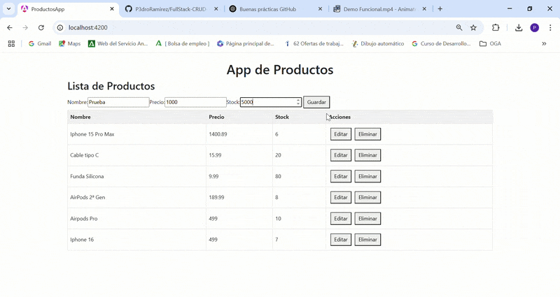

# 🛒 FullStack-CRUD-NET8-Angular-PostgreSQL  
## 📌 Descripción del Proyecto

Aplicación Full Stack completa para gestión de productos con:
- **Backend**: API REST en .NET 8 (C#) con Entity Framework Core
- **Frontend**: Aplicación Angular con TypeScript
- **Base de datos**: PostgreSQL en contenedor Docker
- **Infraestructura**: Docker Compose para orquestación de servicios

  
## 🚀 Tecnologías utilizadas  
- **.NET Core 8 (C#)** - Backend  
- **Angular** - Frontend  
- **PostgreSQL** - Base de datos  
- **Entity Framework Core** - ORM  
- **Docker & Docker Compose** - Contenedores  
- **Swagger** - Documentación de la API  

## 📦 Requisitos previos  
Antes de instalar el proyecto, asegúrate de tener lo siguiente:  

✅ **Docker y Docker Compose**  
✅ **Node.js y Angular CLI**  

Puedes verificar si los tienes instalados con los siguientes comandos:  
```sh
docker --version
docker-compose --version
node -v
ng version
```

## 🎥 Demostración  

Aquí puedes ver la aplicación en funcionamiento:  




