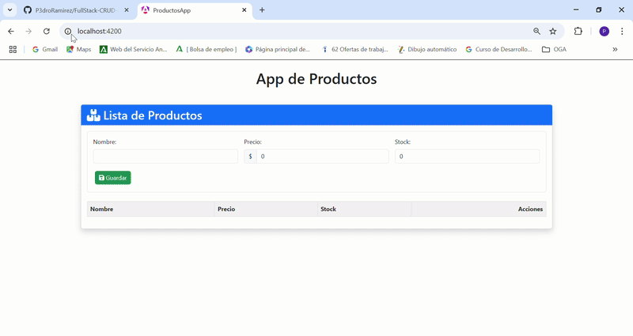

# 🛒 FullStack-CRUD-NET8-Angular-PostgreSQL  
## 📌 Descripción del Proyecto

Aplicación Full Stack completa para gestión de productos con:
- **Backend**: API REST en .NET 8 (C#) con Entity Framework Core
- **Frontend**: Aplicación Angular con TypeScript
- **Base de datos**: PostgreSQL en contenedor Docker
- **Infraestructura**: Docker Compose para orquestación de servicios

  
## 🚀 Tecnologías utilizadas  
- **.NET Core 8 (C#)** - Backend  
- **Angular** - Frontend  
- **PostgreSQL** - Base de datos  
- **Entity Framework Core** - ORM  
- **Docker & Docker Compose** - Contenedores  
- **Swagger** - Documentación de la API  

## 📦 Requisitos previos  
Antes de instalar el proyecto, asegúrate de tener lo siguiente:  

- Docker Desktop ([Descargar](https://www.docker.com/products/docker-desktop/))
- Node.js v18+ ([Descargar](https://nodejs.org/))
- Angular CLI v16+ (`npm install -g @angular/cli`)
- (Opcional) .NET 8 SDK para desarrollo backend

Puedes verificar si los tienes instalados con los siguientes comandos:  
```sh
docker --version
docker-compose --version
node -v
ng version
```
## 🏁 Iniciar la aplicación
1.Clonar repositorio:
```sh
git clone https://github.com/P3droRamirez/FullStack-CRUD-NET8-Angular-PostgreSQL.git
cd FullStack-CRUD-NET8-Angular-PostgreSQL
```
2.Ejecutar con Docker Compose:
```sh
docker-compose up --build
```
Acceder a los servicios:
Frontend: http://localhost:4200

## 🔍 Endpoints de la API

Base URL: `http://localhost:5000/api/Products`

| Método | Endpoint | Descripción | Parámetros | Ejemplo de Request Body |
|--------|----------|-------------|------------|-------------------------|
| **GET** | `/products` | Obtiene todos los productos | - | - |
| **GET** | `/list/{id}` | Obtiene un producto por ID | `id` (GUID) | - |
| **POST** | `/` | Crea un nuevo producto | - | ```json { "name": "Laptop", "price": 999.99, "stock": 10 } ``` |
| **PUT** | `/modify/{id}` | Actualiza un producto existente | `id` (GUID) | ```json { "id": "3fa85f64-5717-4562-b3fc-2c963f66afa6", "name": "Laptop Pro", "price": 1299.99, "stock": 5 } ``` |
| **DELETE** | `/deleteProduct/{id}` | Elimina un producto | `id` (GUID) | - |

### Ejemplos de Uso:

1. **Listar todos los productos**:
   ```bash
   curl -X GET "http://localhost:5000/api/Products/products"
   ```
 2. **Crear un producto**:
   ```bash
   curl -X POST "http://localhost:5000/api/Products" \
    -H "Content-Type: application/json" \
    -d '{"name":"Teclado","price":59.99,"stock":20}'"
  ```
3. **Actualizar producto :
     ```bash
   curl -X PUT "http://localhost:5000/api/Products/modify/3fa85f64-5717-4562-b3fc-2c963f66afa6" \
    -H "Content-Type: application/json" \
    -d '{"id":"3fa85f64-5717-4562-b3fc-2c963f66afa6","name":"Teclado Mecánico","price":89.99,"stock":15}'
    ```
4. **Eliminar producto:
   ```bash
   curl -X DELETE "http://localhost:5000/api/Products/deleteProduct/3fa85f64-5717-4562-b3fc-2c963f66afa6"
    ```
PostgreSQL:

Host: db

Puerto: 5432

Usuario: postgres

Password: P@ssw0rd
## 🎥 Demostración  

Aquí puedes ver la aplicación en funcionamiento:  




